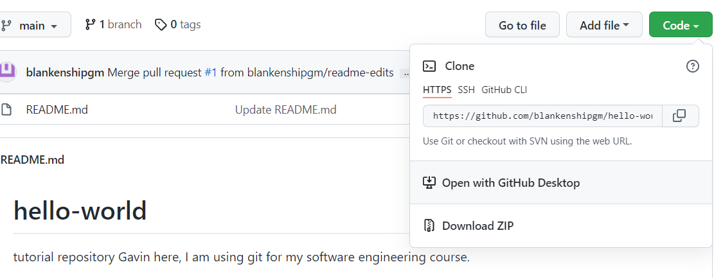

# Git Instruction for Java Code
# Introduction 
This page covers the workflow of using a github repository to add a Java file.
This worklow is important for software engineers to learn, as many companies use git.


# Installation
### Requirements
* A linux terminal
* A github accout
  * Click here to create github account: (https://github.com/login)

# Process
Here's a list of steps to clone a repository, make changes, and then merge the changes to the main repository.

### Step Zero
Clone a repository.

### Step One
Create branch for new work.

### Step Two
Create, modify files.

### Step Three
Add and Commit changes.

### Step Four
Push to origin and generate pull request.

### Step Five
Conduct code review.

### Step Six
Merge main with branch.

# Example
 
### Access repository and perform clone function
1. Click here to access repository: (https://github.com/blankenshipgm/hello-world).
2. Then click the drop down arrow on the green button labeled "Code".
 
3. Make Sure HTTPS is selected and copy the address to your clipboard.
4. Access your linux terminal and go to your desired directory.
5. Write the command "git clone" and the paste the HTTPS address after the command.
6. A line will appear wanting your git username and password.
7. The password is a git access token. You can create one here (https://docs.github.com/en/authentication/keeping-your-account-and-data-secure/creating-a-personal-access-token)
8. Once you have put in your username and access token the cloning process is complete. 
### Create Branch 
1. On the command line of your linux machine write the code "git branch new". This command will create the branch named new.
2. Next, write the command "git checkout new". This command will put you on the new branch.
### Create and Modify Files
1. On the command line write the code "vi HelloWorld.java". This command will take you into a java file named "HelloWolrd".
2. Press the 'i' key to get into insert mode on the java file. 
3. Create a simple main method that prints the string "Hello World" by copying the following code. 
```
 public class HelloWorld
{ 
   public static void main(String[] args)
   {
      System.out.println("Hello World");  
   }
 }
```
4. After you have copied and pasted the code press the 'esc' key then ':' key. This will wll write you out of the java file.
5. Following the ':' key, type "wq" and then press the 'enter' key. This will save the java file and take you back to the command line.
### Add and Commit Changes
1. On the command line write "git add HelloWorld.java". This will prepare your file to be commited to the branch.
2. Next, write the command "git commit -m "Created HelloWorld class" ". This command will commit the HelloWorld class and give a description of what you commited. 
### Push to Origin and Generate Pull Request
1. On the command line write "git push -u origin new". This will attempt to push the new branch to the repository.
2. Before the branch can be pushed you will have to enter your git login credentials again.
3. Then you can go back to the hello-world repository on git. 
4. Near the top of the screen, you will see a new change and a button that says "Compare & Pull Request".

 

5. Click on that button, and then at the bottom there will be a button called "Create Pull Request", click it.
### Merge Main With Branch
1. After clicking the "Create Pull Resquest", click the button that says "Merge Pull request".
### Congratulations!
1. You have successfully clone a respostiory, created a branch, modified files, commited changes, and merged those changes with the Origin. 
2. Now you should be able to see your HelloWorld.java class in the git repository!
 
 ![image(hello world.png)


### FAQ's
1. I got back into git after this tutorial, and I cannot find my access token! where is it?
Answer: The git access token disappears after you create it. You will have to create and new one and save it somewhere on your computer. Saving it elsewhere is the only way to refrain from making a new access token each time you use git.
### GitHub Support
If you have any issues with git contact them here:(https://support.github.com/)
### License
(https://choosealicense.com/licenses/mit/)
